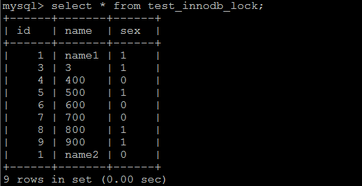

# Mysql高级-02

### 1. 应用优化

前面章节，我们介绍了很多数据库的优化措施。但是在实际生产环境中，由于数据库本身的性能局限，就必须要对前台的应用进行一些优化，来降低数据库的访问压力。

#### 1.1 使用连接池

对于访问数据库来说，建立连接的代价是比较昂贵的，因为我们频繁的创建关闭连接，是比较耗费资源的，我们有必要建立 数据库连接池，以提高访问的性能。


#### 1.2 减少对MySQL的访问

##### 1.2.1 避免对数据进行重复检索

在编写应用代码时，需要能够理清对数据库的访问逻辑。能够一次连接就获取到结果的，就不用两次连接，这样可以大大减少对数据库无用的重复请求。

比如 ，需要获取书籍的id 和name字段 ， 则查询如下： 

```
 select id , name from tb_book;
```

之后，在业务逻辑中有需要获取到书籍状态信息， 则查询如下：

```
select id , status from tb_book;
```

这样，就需要向数据库提交两次请求，数据库就要做两次查询操作。其实完全可以用一条SQL语句得到想要的结果。

```
select id, name , status from tb_book;
```


##### 1.2.2 增加cache层

在应用中，我们可以在应用中增加 缓存 层来达到减轻数据库负担的目的。缓存层有很多种，也有很多实现方式，只要能达到降低数据库的负担又能满足应用需求就可以。

因此可以部分数据从数据库中抽取出来放到应用端以文本方式存储， 或者使用框架(Mybatis, Hibernate)提供的一级缓存/二级缓存，或者使用redis数据库来缓存数据 。


#### 1.3 负载均衡 

负载均衡是应用中使用非常普遍的一种优化方法，它的机制就是利用某种均衡算法，将固定的负载量分布到不同的服务器上， 以此来降低单台服务器的负载，达到优化的效果。

##### 1.3.1 利用MySQL复制分流查询

通过MySQL的主从复制，实现读写分离，使增删改操作走主节点，查询操作走从节点，从而可以降低单台服务器的读写压力。

 

##### 1.3.2 采用分布式数据库架构

分布式数据库架构适合大数据量、负载高的情况，它有良好的拓展性和高可用性。通过在多台服务器之间分布数据，可以实现在多台服务器之间的负载均衡，提高访问效率。


### 2. Mysql中查询缓存优化

#### 2.1 概述

开启Mysql的查询缓存，当执行完全相同的SQL语句的时候，服务器就会直接从缓存中读取结果，当数据被修改，之前的缓存会失效，修改比较频繁的表不适合做查询缓存。

#### 2.2 操作流程

  

1. 客户端发送一条查询给服务器；
2. 服务器先会检查查询缓存，如果命中了缓存，则立即返回存储在缓存中的结果。否则进入下一阶段；
3. 服务器端进行SQL解析、预处理，再由优化器生成对应的执行计划；
4. MySQL根据优化器生成的执行计划，调用存储引擎的API来执行查询；
5. 将结果返回给客户端。

#### 2.3 查询缓存配置

1. 查看当前的MySQL数据库是否支持查询缓存：

   ```SQL
   SHOW VARIABLES LIKE 'have_query_cache';	
   ```

    

2. 查看当前MySQL是否开启了查询缓存 ：

   ```SQL
   SHOW VARIABLES LIKE 'query_cache_type';
   ```

    

3. 查看查询缓存的占用大小 ：

   ```SQL
   SHOW VARIABLES LIKE 'query_cache_size';
   ```

     	

4. 查看查询缓存的状态变量：

   ```SQL
   SHOW STATUS LIKE 'Qcache%';
   ```

    

   各个变量的含义如下：

   | 参数                    | 含义                                                         |
   | ----------------------- | ------------------------------------------------------------ |
   | Qcache_free_blocks      | 查询缓存中的可用内存块数                                     |
   | Qcache_free_memory      | 查询缓存的可用内存量                                         |
   | Qcache_hits             | 查询缓存命中数                                               |
   | Qcache_inserts          | 添加到查询缓存的查询数                                       |
   | Qcache_lowmen_prunes    | 由于内存不足而从查询缓存中删除的查询数                       |
   | Qcache_not_cached       | 非缓存查询的数量（由于 query_cache_type 设置而无法缓存或未缓存） |
   | Qcache_queries_in_cache | 查询缓存中注册的查询数                                       |
   | Qcache_total_blocks     | 查询缓存中的块总数                                           |

#### 2.4 开启查询缓存

MySQL的查询缓存默认是关闭的，需要手动配置参数 query_cache_type ， 来开启查询缓存。query_cache_type 该参数的可取值有三个 ：

| 值          | 含义                                                         |
| ----------- | ------------------------------------------------------------ |
| OFF 或 0    | 查询缓存功能关闭                                             |
| ON 或 1     | 查询缓存功能打开，SELECT的结果符合缓存条件即会缓存，否则，不予缓存，显式指定 SQL_NO_CACHE，不予缓存 |
| DEMAND 或 2 | 查询缓存功能按需进行，显式指定 SQL_CACHE 的SELECT语句才会缓存；其它均不予缓存 |

在 /usr/my.cnf 配置中，增加以下配置 ： 

 		

配置完毕之后，重启服务既可生效 ；

然后就可以在命令行执行SQL语句进行验证 ，执行一条比较耗时的SQL语句，然后再多执行几次，查看后面几次的执行时间；获取通过查看查询缓存的缓存命中数，来判定是否走查询缓存。


#### 2.5 查询缓存SELECT选项

可以在SELECT语句中指定两个与查询缓存相关的选项 ：

SQL_CACHE : 如果查询结果是可缓存的，并且 query_cache_type 系统变量的值为ON或 DEMAND ，则缓存查询结果 。

SQL_NO_CACHE : 服务器不使用查询缓存。它既不检查查询缓存，也不检查结果是否已缓存，也不缓存查询结果。

例子：

```SQL
SELECT SQL_CACHE id, name FROM customer;
SELECT SQL_NO_CACHE id, name FROM customer;
```

​	

#### 2.6 查询缓存失效的情况

1） SQL 语句不一致的情况， 要想命中查询缓存，查询的SQL语句必须一致。

```SQL
SQL1 : select count(*) from tb_item;
SQL2 : Select count(*) from tb_item;
```

2） 当查询语句中有一些不确定的时，则不会缓存。如 ： now() , current_date() , curdate() , curtime() , rand() , uuid() , user() , database() 。

```SQL
SQL1 : select * from tb_item where updatetime < now() limit 1;
SQL2 : select user();
SQL3 : select database();
```

3） 不使用任何表查询语句。

```SQL
select 'A';
```

4）  查询 mysql， information_schema或  performance_schema 数据库中的表时，不会走查询缓存。

```SQL
select * from information_schema.engines;
```

5） 在存储的函数，触发器或事件的主体内执行的查询。

6） 如果表更改，则使用该表的所有高速缓存查询都将变为无效并从高速缓存中删除。这包括使用`MERGE`映射到已更改表的表的查询。一个表可以被许多类型的语句，如被改变 INSERT， UPDATE， DELETE， TRUNCATE TABLE， ALTER TABLE， DROP TABLE，或 DROP DATABASE 。


### 3. Mysql锁问题

#### 3.1 锁概述

锁是计算机协调多个进程或线程并发访问某一资源的机制（避免争抢）。

在数据库中，除传统的计算资源（如 CPU、RAM、I/O 等）的争用以外，数据也是一种供许多用户共享的资源。如何保证数据并发访问的一致性、有效性是所有数据库必须解决的一个问题，锁冲突也是影响数据库并发访问性能的一个重要因素。从这个角度来说，锁对数据库而言显得尤其重要，也更加复杂。


#### 3.2 锁分类

从对数据操作的粒度分 ： 

1） 表锁：操作时，会锁定整个表。

2） 行锁：操作时，会锁定当前操作行。

从对数据操作的类型分：

1） 读锁（共享锁）：针对同一份数据，多个读操作可以同时进行而不会互相影响。

2） 写锁（排它锁）：当前操作没有完成之前，它会阻断其他写锁和读锁。


#### 3.3 Mysql 锁

相对其他数据库而言，MySQL的锁机制比较简单，其最显著的特点是不同的存储引擎支持不同的锁机制。下表中罗列出了各存储引擎对锁的支持情况：
| 存储引擎 | 表级锁 | 行级锁 | 页面锁 |
| -------- | ------ | ------ | ------ |
| MyISAM   | 支持   | 不支持 | 不支持 |
| InnoDB   | 支持   | 支持   | 不支持 |
| MEMORY   | 支持   | 不支持 | 不支持 |
| BDB      | 支持   | 不支持 | 支持   |

MySQL这3种锁的特性可大致归纳如下 ：

| 锁类型 | 特点                                                         |
| ------ | ------------------------------------------------------------ |
| 表级锁 | 偏向MyISAM 存储引擎，开销小，加锁快；不会出现死锁；锁定粒度大，发生锁冲突的概率最高,并发度最低。 |
| 行级锁 | 偏向InnoDB 存储引擎，开销大，加锁慢；会出现死锁；锁定粒度最小，发生锁冲突的概率最低,并发度也最高。 |
| 页面锁 | 开销和加锁时间界于表锁和行锁之间；会出现死锁；锁定粒度界于表锁和行锁之间，并发度一般。 |

从上述特点可见，很难笼统地说哪种锁更好，只能就具体应用的特点来说哪种锁更合适！仅从锁的角度来说：表级锁更适合于以查询为主，只有少量按索引条件更新数据的应用，如Web 应用；而行级锁则更适合于有大量按索引条件并发更新少量不同数据，同时又有并查询的应用，如一些在线事务处理（OLTP）系统。


#### 3.4 MyISAM 表锁

MyISAM 存储引擎只支持表锁，这也是MySQL开始几个版本中唯一支持的锁类型。


##### 3.4.1 如何加表锁

MyISAM 在执行查询语句（SELECT）前，会自动给涉及的所有表加读锁，在执行更新操作（UPDATE、DELETE、INSERT 等）前，会自动给涉及的表加写锁，这个过程并不需要用户干预，因此，用户一般不需要直接用 LOCK TABLE 命令给 MyISAM 表显式加锁。

显示加表锁语法：

```SQL
加读锁 ： lock table table_name read;

加写锁 ： lock table table_name write；
```


##### 3.4.2 读锁案例 

准备环境

```SQL
create database demo_03 default charset=utf8mb4;

use demo_03;

CREATE TABLE `tb_book` (
  `id` INT(11) auto_increment,
  `name` VARCHAR(50) DEFAULT NULL,
  `publish_time` DATE DEFAULT NULL,
  `status` CHAR(1) DEFAULT NULL,
  PRIMARY KEY (`id`)
) ENGINE=myisam DEFAULT CHARSET=utf8 ;

INSERT INTO tb_book (id, name, publish_time, status) VALUES(NULL,'java编程思想','2088-08-01','1');
INSERT INTO tb_book (id, name, publish_time, status) VALUES(NULL,'solr编程思想','2088-08-08','0');


CREATE TABLE `tb_user` (
  `id` INT(11) auto_increment,
  `name` VARCHAR(50) DEFAULT NULL,
  PRIMARY KEY (`id`)
) ENGINE=myisam DEFAULT CHARSET=utf8 ;

INSERT INTO tb_user (id, name) VALUES(NULL,'令狐冲');
INSERT INTO tb_user (id, name) VALUES(NULL,'田伯光');

```


客户端 一 ：

1）获得tb_book 表的读锁 

```
lock table tb_book read;
```


2） 执行查询操作

```
select * from tb_book;
```

 

可以正常执行 ， 查询出数据。


客户端 二 ：

3） 执行查询操作

```
select * from tb_book;
```

 


客户端 一 ：

4）查询未锁定的表

```
select name from tb_seller;
```

 


客户端 二 ：

5）查询未锁定的表

```
select name from tb_seller;
```

 

可以正常查询出未锁定的表；


客户端 一 ：

6） 执行插入操作 

```
insert into tb_book values(null,'Mysql高级','2088-01-01','1');
```

 

执行插入， 直接报错 ， 由于当前tb_book 获得的是 读锁， 不能执行更新操作。


客户端 二 ：

7） 执行插入操作 

```
insert into tb_book values(null,'Mysql高级','2088-01-01','1');
```

 


当在客户端一中释放锁指令 unlock tables  后 ， 客户端二中的 inesrt 语句 ， 立即执行 ；


##### 3.4.3 写锁案例

客户端 一 :

1）获得tb_book 表的写锁 

```
lock table tb_book write ;
```

2）执行查询操作

```
select * from tb_book ;
```

 

查询操作执行成功；

3）执行更新操作

```
update tb_book set name = 'java编程思想（第二版）' where id = 1;
```

 

更新操作执行成功 ；


客户端 二 :

4）执行查询操作

```
select * from tb_book ;
```

 


当在客户端一中释放锁指令 unlock tables  后 ， 客户端二中的 select 语句 ， 立即执行 ；

 


##### 3.4.4 结论

锁模式的相互兼容性如表中所示：

 

由上表可见： 

​	1） 对MyISAM 表的读操作，不会阻塞其他用户对同一表的读请求，但会阻塞对同一表的写请求；

​	2） 对MyISAM 表的写操作，则会阻塞其他用户对同一表的读和写操作；

​	简而言之，就是读锁会阻塞写，但是不会阻塞读。而写锁，则既会阻塞读，又会阻塞写。


此外，MyISAM 的读写锁调度是写优先，这也是MyISAM不适合做写为主的表的存储引擎的原因。因为写锁后，其他线程不能做任何操作，大量的更新会使查询很难得到锁，从而造成永远阻塞。


##### 3.3.5 查看锁的争用情况

``` 
show open tables；
```

 

In_use : 表当前被查询使用的次数。如果该数为零，则表是打开的，但是当前没有被使用。

Name_locked：表名称是否被锁定。名称锁定用于取消表或对表进行重命名等操作。


```
show status like 'Table_locks%';
```

 

Table_locks_immediate ： 指的是能够立即获得表级锁的次数，每立即获取锁，值加1。

Table_locks_waited ： 指的是不能立即获取表级锁而需要等待的次数，每等待一次，该值加1，此值高说明存在着较为严重的表级锁争用情况。


#### 3.5 InnoDB 行锁

##### 3.5.1 行锁介绍

行锁特点 ：偏向InnoDB 存储引擎，开销大，加锁慢；会出现死锁；锁定粒度最小，发生锁冲突的概率最低 , 并发度也最高。

InnoDB 与 MyISAM 的最大不同有两点：一是支持事务；二是 采用了行级锁。


##### 3.5.2 背景知识

**事务及其ACID属性**

事务是由一组SQL语句组成的逻辑处理单元。

事务具有以下4个特性，简称为事务ACID属性。

| ACID属性             | 含义                                                         |
| -------------------- | ------------------------------------------------------------ |
| 原子性（Atomicity）  | 事务是一个原子操作单元，其对数据的修改，要么全部成功，要么全部失败。 |
| 一致性（Consistent） | 在事务开始和完成时，数据都必须保持一致状态。                 |
| 隔离性（Isolation）  | 数据库系统提供一定的隔离机制，保证事务在不受外部并发操作影响的 “独立” 环境下运行。 |
| 持久性（Durable）    | 事务完成之后，对于数据的修改是永久的。                       |


**并发事务处理带来的问题**

| 问题                               | 含义                                                         |
| ---------------------------------- | ------------------------------------------------------------ |
| 丢失更新（Lost Update）            | 当两个或多个事务选择同一行，最初的事务修改的值，会被后面的事务修改的值覆盖。 |
| 脏读（Dirty Reads）                | 当一个事务正在访问数据，并且对数据进行了修改，而这种修改还没有提交到数据库中，这时，另外一个事务也访问这个数据，然后使用了这个数据。 |
| 不可重复读（Non-Repeatable Reads） | 一个事务在读取某些数据后的某个时间，再次读取以前读过的数据，却发现和以前读出的数据不一致。 |
| 幻读（Phantom Reads）              | 一个事务按照相同的查询条件重新读取以前查询过的数据，却发现其他事务插入了满足其查询条件的新数据。 |


**事务隔离级别**

为了解决上述提到的事务并发问题，数据库提供一定的事务隔离机制来解决这个问题。数据库的事务隔离越严格，并发副作用越小，但付出的代价也就越大，因为事务隔离实质上就是使用事务在一定程度上“串行化” 进行，这显然与“并发” 是矛盾的。 

数据库的隔离级别有4个，由低到高依次为Read uncommitted、Read committed、Repeatable read、Serializable，这四个级别可以逐个解决脏写、脏读、不可重复读、幻读这几类问题。

| 隔离级别                | 丢失更新 | 脏读 | 不可重复读 | 幻读 |
| ----------------------- | -------- | ---- | ---------- | ---- |
| Read uncommitted        | ×        | √    | √          | √    |
| Read committed          | ×        | ×    | √          | √    |
| Repeatable read（默认） | ×        | ×    | ×          | √    |
| Serializable            | ×        | ×    | ×          | ×    |

备注 ： √  代表可能出现 ， × 代表不会出现 。

Mysql 的数据库的默认隔离级别为 Repeatable read ， 查看方式：

```
show variables like 'tx_isolation';
```

  


##### 3.5.3 InnoDB 的行锁模式

InnoDB  实现了以下两种类型的行锁。

- 共享锁（S）：又称为读锁，简称S锁，共享锁就是多个事务对于同一数据可以共享一把锁，都能访问到数据，但是只能读不能修改。
- 排他锁（X）：又称为写锁，简称X锁，排他锁就是不能与其他锁并存，如一个事务获取了一个数据行的排他锁，其他事务就不能再获取该行的其他锁，包括共享锁和排他锁，但是获取排他锁的事务是可以对数据就行读取和修改。

对于UPDATE、DELETE和INSERT语句，InnoDB会自动给涉及数据集加排他锁（X)；

对于普通SELECT语句，InnoDB不会加任何锁；


可以通过以下语句显示给记录集加共享锁或排他锁 。

```
共享锁（S）：SELECT * FROM table_name WHERE ... LOCK IN SHARE MODE

排他锁（X) ：SELECT * FROM table_name WHERE ... FOR UPDATE
```


##### 3.5.4 案例准备工作

```sql
create table test_innodb_lock(
	id int(11),
	name varchar(16),
	sex varchar(1)
)engine = innodb default charset=utf8;

insert into test_innodb_lock values(1,'100','1');
insert into test_innodb_lock values(3,'3','1');
insert into test_innodb_lock values(4,'400','0');
insert into test_innodb_lock values(5,'500','1');
insert into test_innodb_lock values(6,'600','0');
insert into test_innodb_lock values(7,'700','0');
insert into test_innodb_lock values(8,'800','1');
insert into test_innodb_lock values(9,'900','1');
insert into test_innodb_lock values(1,'200','0');

create index idx_test_innodb_lock_id on test_innodb_lock(id);
create index idx_test_innodb_lock_name on test_innodb_lock(name);
```


##### 3.5.5 行锁基本演示

| Session-1                                                    | Session-2                                                    |
| ------------------------------------------------------------ | ------------------------------------------------------------ |
|       关闭自动提交功能 |   关闭自动提交功能 |
|  可以正常的查询出全部的数据 |  可以正常的查询出全部的数据 |
| 查询id 为3的数据 ； | 获取id为3的数据 ； |
|  更新id为3的数据，但是不提交； |  更新id为3 的数据， 出于等待状态 |
|  通过commit， 提交事务 |  解除阻塞，更新正常进行 |
| 以上， 操作的都是同一行的数据，接下来，演示不同行的数据 ：   |                                                              |
|  更新id为3数据，正常的获取到行锁 ， 执行更新 ； |  由于与Session-1 操作不是同一行，获取当前行锁，执行更新； |


##### 3.5.6 无索引行锁升级为表锁

如果不通过索引条件检索数据，那么InnoDB将对表中的所有记录加锁，实际效果跟表锁一样。


查看当前表的索引 ： show  index  from test_innodb_lock ;

 

| Session-1                                                    | Session-2                                                    |
| ------------------------------------------------------------ | ------------------------------------------------------------ |
| 关闭事务的自动提交 | 关闭事务的自动提交 |
| 执行更新语句 ：    | 执行更新语句， 但处于阻塞状态： |
| 提交事务：         | 解除阻塞，执行更新成功 ： |
|                                                              | 执行提交操作 ：    |

由于 执行更新时 ， name字段本来为varchar类型， 我们是作为数组类型使用，存在类型转换，索引失效，最终行锁变为表锁 ；


##### 3.5.7 间隙锁危害

当我们用范围条件，而不是使用相等条件检索数据，并请求共享或排他锁时，InnoDB会给符合条件的已有数据进行加锁； 对于键值在条件范围内但并不存在的记录，叫做 "间隙（GAP）" ， InnoDB也会对这个 "间隙" 加锁，这种锁机制就是所谓的 间隙锁（Next-Key锁） 。

示例 ： 

| Session-1                                                    | Session-2                                                    |
| ------------------------------------------------------------ | ------------------------------------------------------------ |
| 关闭事务自动提交   | 关闭事务自动提交   |
| 根据id范围更新数据 |                                                              |
|                                                              | 插入id为2的记录， 出于阻塞状态 |
| 提交事务 ；        |                                                              |
|                                                              | 解除阻塞 ， 执行插入操作 ： |
|                                                              | 提交事务 ：                                                  |


##### 3.5.8 InnoDB 行锁争用情况

```sql
show  status like 'innodb_row_lock%';
```


```
Innodb_row_lock_current_waits: 当前正在等待锁定的数量

Innodb_row_lock_time: 从系统启动到现在锁定总时间长度

Innodb_row_lock_time_avg:每次等待所花平均时长

Innodb_row_lock_time_max:从系统启动到现在等待最长的一次所花的时间

Innodb_row_lock_waits: 系统启动后到现在总共等待的次数


当等待的次数很高，而且每次等待的时长也不小的时候，我们就需要分析系统中为什么会有如此多的等待，然后根据分析结果着手制定优化计划。

```


##### 3.5.9 总结

InnoDB存储引擎由于实现了行级锁定，虽然在锁定机制的实现方面带来了性能损耗可能比表锁会更高一些，但是在整体并发处理能力方面要远远由于MyISAM的表锁的。当系统并发量较高的时候，InnoDB的整体性能和MyISAM相比就会有比较明显的优势。

但是，InnoDB的行级锁同样也有其脆弱的一面，当我们使用不当的时候，可能会让InnoDB的整体性能表现不仅不能比MyISAM高，甚至可能会更差。


优化建议：

- 尽可能让所有数据检索都能通过索引来完成，避免无索引行锁升级为表锁。
- 合理设计索引，尽量缩小锁的范围
- 尽可能减少索引条件，及索引范围，避免间隙锁
- 尽量控制事务大小，减少锁定资源量和时间长度
- 尽可使用低级别事务隔离（但是需要业务层面满足需求）


### 4. Mysql 日志

在任何一种数据库中，都会有各种各样的日志，记录着数据库工作的方方面面，以帮助数据库管理员追踪数据库曾经发生过的各种事件。MySQL 也不例外，在 MySQL 中，有 4 种不同的日志，分别是错误日志、二进制日志（BINLOG 日志）、查询日志和慢查询日志，这些日志记录着数据库在不同方面的踪迹。

#### 4.1 错误日志

错误日志是 MySQL 中最重要的日志之一，它记录了当 mysqld 启动和停止时，以及服务器在运行过程中发生任何严重错误时的相关信息。当数据库出现任何故障导致无法正常使用时，可以首先查看此日志。

该日志是默认开启的 ， 默认存放目录为 mysql 的数据目录（var/lib/mysql）, 默认的日志文件名为  hostname.err（hostname是主机名）。

查看日志位置指令 ： 

```sql
show variables like 'log_error%';
```

 


查看日志内容 ： 

```shell
tail -f /var/lib/mysql/xaxh-server.err
```

 


#### 4.2 二进制日志

##### 4.2.1概述

二进制日志（BINLOG）记录了所有的 DDL（数据定义语言）语句和 DML（数据操纵语言）语句，但是不包括数据查询语句。此日志对于灾难时的数据恢复起着极其重要的作用，MySQL的主从复制， 就是通过该binlog实现的。

二进制日志，默认情况下是没有开启的，需要到MySQL的配置文件中开启，并配置MySQL日志的格式。 

配置文件位置 : /usr/my.cnf

日志存放位置 : 配置时，给定了文件名但是没有指定路径，日志默认写入Mysql的数据目录。

```
#配置开启binlog日志， 日志的文件前缀为 mysqlbin -----> 生成的文件名如 : mysqlbin.000001,mysqlbin.000002
log_bin=mysqlbin

#配置二进制日志的格式
binlog_format=STATEMENT

```


##### 4.2.2 日志格式

**STATEMENT**

该日志格式在日志文件中记录的都是SQL语句（statement），每一条对数据进行修改的SQL都会记录在日志文件中，通过Mysql提供的mysqlbinlog工具，可以清晰的查看到每条语句的文本。主从复制的时候，从库（slave）会将日志解析为原文本，并在从库重新执行一次。


**ROW**

该日志格式在日志文件中记录的是每一行的数据变更，而不是记录SQL语句。比如，执行SQL语句 ： update tb_book set status='1' , 如果是STATEMENT 日志格式，在日志中会记录一行SQL文件； 如果是ROW，由于是对全表进行更新，也就是每一行记录都会发生变更，ROW 格式的日志中会记录每一行的数据变更。


**MIXED**

这是目前MySQL默认的日志格式，即混合了STATEMENT 和 ROW两种格式。默认情况下采用STATEMENT，但是在一些特殊情况下采用ROW来进行记录。MIXED 格式能尽量利用两种模式的优点，而避开他们的缺点。


##### 4.2.3 日志读取

由于日志以二进制方式存储，不能直接读取，需要用mysqlbinlog工具来查看，语法如下 ：

```
mysqlbinlog log-file；

```


**查看STATEMENT格式日志** 

执行插入语句 ：

```SQL
insert into tb_book values(null,'Lucene','2088-05-01','0');
```

 查看日志文件 ：

 

mysqlbin.index : 该文件是日志索引文件 ， 记录日志的文件名；

mysqlbing.000001 ：日志文件

查看日志内容 ：

```
mysqlbinlog mysqlbing.000001；

```

 


**查看ROW格式日志**

配置 :

```
#配置开启binlog日志， 日志的文件前缀为 mysqlbin -----> 生成的文件名如 : mysqlbin.000001,mysqlbin.000002
log_bin=mysqlbin

#配置二进制日志的格式
binlog_format=ROW

```

插入数据 :

```sql
insert into tb_book values(null,'SpringCloud实战','2088-05-05','0');
```

如果日志格式是 ROW , 直接查看数据 , 是查看不懂的 ; 可以在mysqlbinlog 后面加上参数 -vv  

```SQL
mysqlbinlog -vv mysqlbin.000002 
```

 


##### 4.2.4 日志删除

对于比较繁忙的系统，由于每天生成日志量大 ，这些日志如果长时间不清楚，将会占用大量的磁盘空间。下面我们将会讲解几种删除日志的常见方法 ：

**方式一** 

通过 Reset Master 指令删除全部 binlog 日志，删除之后，日志编号，将从 xxxx.000001重新开始 。

查询之前 ，先查询下日志文件 ： 

   

执行删除日志指令： 

```
Reset Master
```

执行之后， 查看日志文件 ：

 


**方式二**

执行指令 ``` purge  master logs to 'mysqlbin.******'``` ，该命令将删除  ``` ******``` 编号之前的所有日志。 


**方式三**

执行指令 ``` purge master logs before 'yyyy-mm-dd hh24:mi:ss'``` ，该命令将删除日志为 "yyyy-mm-dd hh24:mi:ss" 之前产生的所有日志 。


**方式四**

设置参数 --expire_logs_days=# ，此参数的含义是设置日志的过期天数， 过了指定的天数后日志将会被自动删除，这样将有利于减少DBA 管理日志的工作量。

配置如下 ： 

 


#### 4.3 查询日志

查询日志中记录了客户端的所有操作语句，而二进制日志不包含查询数据的SQL语句。

默认情况下， 查询日志是未开启的。如果需要开启查询日志，可以设置以下配置 ：

```
#该选项用来开启查询日志 ， 可选值 ： 0 或者 1 ； 0 代表关闭， 1 代表开启 
general_log=1

#设置日志的文件名 ， 如果没有指定， 默认的文件名为 host_name.log 
general_log_file=file_name

```

在 mysql 的配置文件 /usr/my.cnf 中配置如下内容 ： 

 


配置完毕之后，在数据库执行以下操作 ：

```
select * from tb_book;
select * from tb_book where id = 1;
update tb_book set name = 'lucene入门指南' where id = 5;
select * from tb_book where id < 8;

```


执行完毕之后， 再次来查询日志文件 ： 

 


#### 4.4 慢查询日志

慢查询日志记录了所有执行时间超过参数 long_query_time 设置值并且扫描记录数不小于 min_examined_row_limit 的所有的SQL语句的日志。long_query_time 默认为 10 秒，最小为 0， 精度可以到微秒。


##### 4.4.1 文件位置和格式

慢查询日志默认是关闭的 。可以通过两个参数来控制慢查询日志 ：

```
# 该参数用来控制慢查询日志是否开启， 可取值： 1 和 0 ， 1 代表开启， 0 代表关闭
slow_query_log=1 

# 该参数用来指定慢查询日志的文件名
slow_query_log_file=slow_query.log

# 该选项用来配置查询的时间限制， 超过这个时间将认为值慢查询， 将需要进行日志记录， 默认10s
long_query_time=10

```


##### 4.4.2 日志的读取

和错误日志、查询日志一样，慢查询日志记录的格式也是纯文本，可以被直接读取。

1） 查询long_query_time 的值。

 


2） 执行查询操作

```sql
select id, title,price,num ,status from tb_item where id = 1;
```


由于该语句执行时间很短，为0s ， 所以不会记录在慢查询日志中。


```
select * from tb_item where title like '%阿尔卡特 (OT-927) 炭黑 联通3G手机 双卡双待165454%' ;


```

 

该SQL语句 ， 执行时长为 26.77s ，超过10s ， 所以会记录在慢查询日志文件中。


3） 查看慢查询日志文件

直接通过cat 指令查询该日志文件 ： 

 


如果慢查询日志内容很多， 直接查看文件，比较麻烦， 这个时候可以借助于mysql自带的 mysqldumpslow 工具， 来对慢查询日志进行分类汇总。 

 


### 5. Mysql复制

#### 5.1 复制概述

复制是指将主数据库的DDL 和 DML 操作通过二进制日志传到从库服务器中，然后在从库上对这些日志重新执行（也叫重做），从而使得从库和主库的数据保持同步。

MySQL支持一台主库同时向多台从库进行复制， 从库同时也可以作为其他从服务器的主库，实现链状复制。


#### 5.2 复制原理

MySQL 的主从复制原理如下。

 

从上层来看，复制分成三步：

- Master 主库在事务提交时，会把数据变更作为时间 Events 记录在二进制日志文件 Binlog 中。
- 主库推送二进制日志文件 Binlog 中的日志事件到从库的中继日志 Relay Log 。
- slave重做中继日志中的事件，将改变反映它自己的数据。


#### 5.3 复制优势

MySQL 复制的有点主要包含以下三个方面：

- 主库出现问题，可以快速切换到从库提供服务。
- 可以在从库上执行查询操作，从主库中更新，实现读写分离，降低主库的访问压力。
- 可以在从库中执行备份，以避免备份期间影响主库的服务。


#### 5.4 搭建步骤

##### 5.4.1 master

1） 在master 的配置文件（/usr/my.cnf）中，配置如下内容：

```properties
#mysql 服务ID,保证整个集群环境中唯一
server-id=1

#mysql binlog 日志的存储路径和文件名
log-bin=/var/lib/mysql/mysqlbin

#错误日志,默认已经开启
#log-err

#mysql的安装目录
#basedir

#mysql的临时目录
#tmpdir

#mysql的数据存放目录
#datadir

#是否只读,1 代表只读, 0 代表读写
read-only=0

#忽略的数据, 指不需要同步的数据库
binlog-ignore-db=mysql

#指定同步的数据库
#binlog-do-db=db01
```

2） 执行完毕之后，需要重启Mysql：

```sql
service mysql restart ；
```

3） 创建同步数据的账户，并且进行授权操作：

```sql
grant replication slave on *.* to 'itcast'@'192.168.192.131' identified by 'itcast';	

flush privileges;
```

4） 查看master状态：

```sql
show master status;
```

 

字段含义：

```
File : 从哪个日志文件开始推送日志文件 
Position ： 从哪个位置开始推送日志
Binlog_Ignore_DB : 指定不需要同步的数据库

```


##### 5.4.2 slave

1） 在 slave 端配置文件中，配置如下内容：

```properties
#mysql服务端ID,唯一
server-id=2

#指定binlog日志
log-bin=/var/lib/mysql/mysqlbin
```

2）  执行完毕之后，需要重启Mysql：

```
service mysql restart；

```

3） 执行如下指令 ：

```sql
change master to master_host= '192.168.192.134', master_user='itcast', master_password='itcast', master_log_file='mysqlbin.000001', master_log_pos=413;
```

指定当前从库对应的主库的IP地址，用户名，密码，从哪个日志文件开始的那个位置开始同步推送日志。

4） 开启同步操作

```
start slave;

show slave status;

```

 

5） 停止同步操作

```
stop slave;
```


##### 5.4.3 验证同步操作

1） 在主库中创建数据库，创建表，并插入数据 ：

```sql
create database db01;

user db01;

create table user(
	id int(11) not null auto_increment,
	name varchar(50) not null,
	sex varchar(1),
	primary key (id)
)engine=innodb default charset=utf8;

insert into user(id,name,sex) values(null,'Tom','1');
insert into user(id,name,sex) values(null,'Trigger','0');
insert into user(id,name,sex) values(null,'Dawn','1');
```

2） 在从库中查询数据，进行验证 ：

在从库中，可以查看到刚才创建的数据库：

 

在该数据库中，查询user表中的数据：

 


